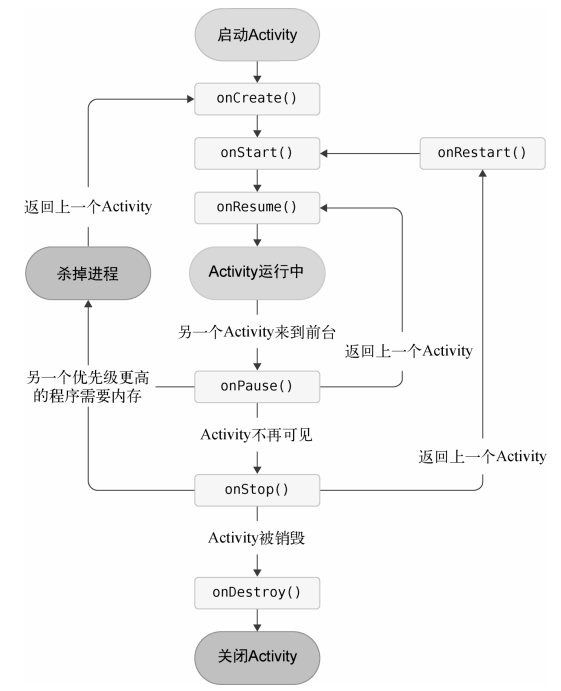
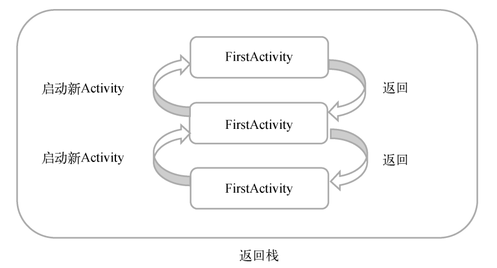
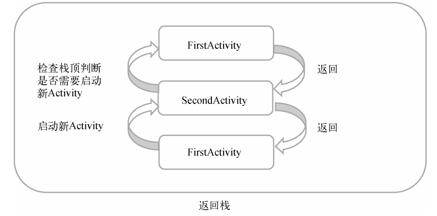
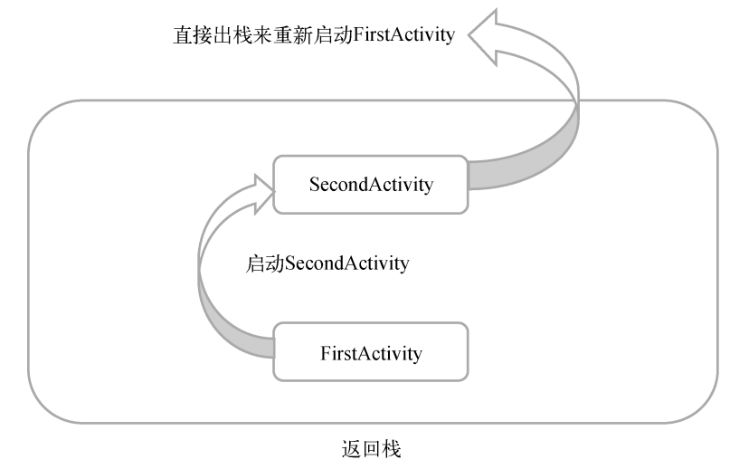
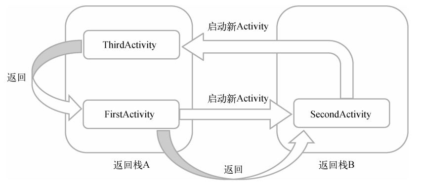

## 1. Activity 是什么

是一种包含用户界面的组件，主要用于和用户进行交互。

```kotlin
<LinearLayout xmlns:android="http://schemas.android.com/apk/res/android"
    android:orientation="vertical"
    android:layout_width="match_parent"
    android:layout_height="match_parent">

    <Button
        android:id="@+id/button1"
        android:layout_width="match_parent"
        android:layout_height="wrap_content"
        android:text="Button 1"
        />
</LinearLayout>
```

这里添加了一个`Button`元素，并在`Button`元素的内部添加了几个属性。

`android:id`是给当前元素定义了一个唯一的标识符，之后可以在代码中对这个元素进行操作。

`android:layout_width`指定了当前元素的宽度。`android:layout_height`指定了当前元素的高度。

`wrap_content`表示当前元素的高度只要能刚好包含里面的内容。

`android:text`指定了元素显示的内容。

`findViewById()`函数就是获取布局文件中的控件的实例

```kotlin
class MainActivity : AppCompatActivity() {
    override fun onCreate(savedInstanceState: Bundle?) {
        super.onCreate(savedInstanceState)
        setContentView(R.layout.first_layout)
        val button1: Button = findViewById(R.id.button1)
        button1.setOnClickListener {
            Toast.makeText(this, "You clicked Button 1", Toast.LENGTH_SHORT).show()
        }
    }
}
```

`Toast`是 Android 系统提供的一种非常好的提醒方式，在程序中可以使用它将一些短小的信息通知给用户，这些信息会在一段时间后自动消失，并且不会占用任何屏幕空间。

`makeText()`函数需要传入3个参数。第一个参数是`Context`，也就是`Toast`要求的上下文，由于`Activity`本身就是 Context 对象，因此这里直接传入 this 即可。第二个参数是`Toast`显示的文本内容。第三个参数显示时长，有两个内置常量可以选择：`Toast.LENGTH_SHORT`和`Toast.LENGTH_LONG`


### 1.1 创建菜单

```kotlin
// FirstActivity.kt
package com.example.myapplication

import android.os.Bundle
import android.view.Menu
import android.view.MenuItem
import android.widget.Button
import android.widget.Toast
import androidx.appcompat.app.AppCompatActivity

class MainActivity : AppCompatActivity() {
    override fun onCreate(savedInstanceState: Bundle?) {
        super.onCreate(savedInstanceState)
        setContentView(R.layout.first_layout)
        val button1: Button = findViewById(R.id.button1)
        button1.setOnClickListener {
            Toast.makeText(this, "You clicked Button 1", Toast.LENGTH_SHORT).show()
        }
    }

    override fun onCreateOptionsMenu(menu: Menu?): Boolean {
        menuInflater.inflate(R.menu.main,menu)
        return true
    }

    override fun onOptionsItemSelected(item: MenuItem): Boolean {
        when(item.itemId){
            R.id.add_item -> Toast.makeText(this,"You clicked Add",Toast.LENGTH_SHORT).show()
            R.id.remove_item -> Toast.makeText(this,"You clicked Remove",Toast.LENGTH_SHORT).show()
        }
        return true
    }

}

// main.xml

<?xml version="1.0" encoding="utf-8"?>
<menu xmlns:android="http://schemas.android.com/apk/res/android">
    <item
       android:id="@+id/add_item"
       android:title="Add"
      />
    <item
        android:id="@+id/remove_item"
        android:title="Remove"
        />
</menu>
```


**销毁了一个Activity**

```kotlin
button1.setOnClickListener {
 finish()
} 
```

## 2. 使用 Intent 在 Activity之间穿梭

### 2.1 返回数据给下一个Activity

`Intent`是Android程序中各组件之间进行交互的一种重要方式，它不仅可以指明当前组件想要执行的动作，还可以在不同组件之间传递数据。

`Intent`有多个构造函数的重载，其中一个是`Intent(Context packageContext,Class<?> cls)`。这个构造函数接收两个参数：第一个参数 Context 要求提供一下启动 Activity 的上下文；第二个参数 Class 用于指定想要启动的目标 Activity。
`startActivity()`函数专门用于启动 Activity 它接收了一个 Intent 参数。

```kotlin
// 转到拨号界面
button1.setOnClickListener {
 val intent = Intent(Intent.ACTION_DIAL)
 intent.data = Uri.parse("tel:10086")
 startActivity(intent)
}

// 转到网页界面
button1.setOnclickListener{
 val intent = Intent(Intent.ACTION_VIEW) 
 intent.data = Uri.parse("https://www.baidu.com")
 startActivity(intent) 
}

// 转到地理界面

button1.setOnClickListener {
 val intent = Intent(Intent.ACTION_DIAL)
 intent.data = Uri.parse("geo:???")
 startActivity(intent)
}
```


`Intent`中提供了一系列`putExtra()`方法的重载，可以把我们想要传递的数据存在`Intent`中，在启动另一个`Activity`后，只需要把这些数据从`Intent`取出就可以了。

```kotlin
button1.setOnClickListener {
 val data = "Hello SecondActivity"
 val intent = Intent(this, SecondActivity::class.java)
 intent.putExtra("extra_data", data)
 startActivity(intent)
}
```

`putExtra()`函数接收两个参数，第一个参数是键，用于之后从`Intent`取值，第二个参数才是真正要传递的数据。


```kotlin
class SecondActivity : AppCompatActivity() {
    override fun onCreate(savedInstanceState: Bundle?) {
        super.onCreate(savedInstanceState)
        setContentView(R.layout.activity_second)
        val button2: Button = findViewById(R.id.button2)
        button2.setOnClickListener{
           val extraData = intent.getStringExtra("extra_data")
            Log.d("SecondActivity","extra data is $extraData")
        }
    }
}
```

这里由于我们传递的是字符串，所以使用 `getStringExtra()` 函数来获取传递的数据。如果传递的是整型数据，则使用`getIntExtra()`，如果传递的是布尔型数据，则使用 `getBooleanExtra()`方法，以此类推。


### 2.2 返回数据给上一个Activity

`startActivityForResult()`方法，期望在 Activity 销毁的时候能够返回一个结果给上一个Activity、

`startActivityForResult()`方法接收两个参数：第一个参数还是 Intent；第二个参数是请求码，用于在之后的回调中判断数据的来源。

```kotlin
// FirstActivity
override fun onCreate(savedInstanceState: Bundle?) {
        super.onCreate(savedInstanceState)
        setContentView(R.layout.first_layout)
        val button1: Button = findViewById(R.id.button1)
        var activityResultLauncher: ActivityResultLauncher<Intent>
        activityResultLauncher = registerForActivityResult(ActivityResultContracts.StartActivityForResult()) { result ->
            if (result.resultCode == RESULT_OK) {
                val returnedData = result.data?.getStringExtra("data_return")
                Log.d("FirstActivity", "returned data is $returnedData")
            }
        }
        button1.setOnClickListener {
            val intent = Intent(this, SecondActivity::class.java)
            activityResultLauncher.launch(intent)
        }
    }

// SecondAvitivy
    override fun onCreate(savedInstanceState: Bundle?) {
        super.onCreate(savedInstanceState)
        setContentView(R.layout.activity_second)
        val button2: Button = findViewById(R.id.button2)
        button2.setOnClickListener{
            val intent = Intent()
            intent.putExtra("data_return", "Hello FirstActivity")
            setResult(RESULT_OK, intent)
            finish()
        }
    }
```

> 因为 startActionForResult 被废弃了，所以上文用的 activityResultLauncher

## 3. Activity 的生命周期



```kotlin
override fun onCreate(savedInstanceState: Bundle?) {
    super.onCreate(savedInstanceState)
    Log.d(tag, "onCreate")
    setContentView(R.layout.activity_life_cycle_test)
    if (savedInstanceState != null) {
        val tempData = savedInstanceState.getString("data_key")
        Log.d(tag, "tempData is $tempData")
    }
}

override fun onSaveInstanceState(outState: Bundle) {
        super.onSaveInstanceState(outState)
        val tempData = "Something you just typed"
        outState.putString("data_key", tempData)
    }
```

Activity 中还提供了一个`onSaveInstanceState()`回调方法，这个方法可以保证在 Activity 被回收之前一定会被调用，因此我们可以通过这个方法来解决问题。

`onSaveInstanceState()`方法会携带一个 Bundle 类型的参数，Bundle 提供了一系列的方法用于保存数据，比如`putString()`保存字符串，`putInt()`保存整型数据。


## 4. Activity 的启动模式

### 4.1 standard

standard 的原理图：



standard 是 Activity 默认的启动模式，在不进行显示指定的情况下，所有 Activity 都会自动使用这种启动模式。

### 4.2 SingTop

SingTop的原理图：



```xml
<activity
 android:name=".FirstActivity"
 android:launchMode="singleTop"
 android:label="This is FirstActivity">
 <intent-filter>
<action android:name="android.intent.action.MAIN"/>
<category android:name="android.intent.category.LAUNCHER"/>
 </intent-filter>
</activity> 
```

修改 `AndroidManifest.xml` 中`FirstActivity` 的启动模式

### 4.3 singleTask

singleTask的原理图：



```xml
<activity
 android:name=".FirstActivity"
 android:launchMode="singleTask"
 android:label="This is FirstActivity">
 <intent-filter>
<action android:name="android.intent.action.MAIN" />
<category android:name="android.intent.category.LAUNCHER" />
 </intent-filter>
</activity>
```

修改 `AndroidManifest.xml` 中`FirstActivity` 的启动模式

### 4.4 singleInstance

singleInstance的原理图：



```xml
<activity android:name=".SecondActivity"
 android:launchMode="singleInstance">
 <intent-filter>
 <action android:name="com.example.activitytest.ACTION_START" />
 <category android:name="android.intent.category.DEFAULT" />
 <category android:name="com.example.activitytest.MY_CATEGORY" />
 </intent-filter>
</activity> 
```

修改 `AndroidManifest.xml` 中`SecondActivity` 的启动模式

## 5. Kotlin课堂：标准函数和静态方法

### 5.1 标准函数 with

with函数接收两个参数：第一个参数可以是一个任意类型的对象，第二个参数是一个 Lambda 表达式。with 函数会在 Lambda 表达式中提供第一个参数对象 的上下文，并使用 Lambda 表达式中的最后一行代码作为返回值返回。示例代码如下：

```kotlin
val result = with(obj) {
 // 这里是obj的上下文
 "value" // with函数的返回值
}
```

它可以在连续调用同一个对象的多个方法时让代码变得更加精简。

比如有一个水果列表，现在我们想吃完所有水果，并将结果打印出来，就可以这样写：

```kotlin
val list = listOf("Apple", "Banana", "Orange", "Pear", "Grape")
val builder = StringBuilder()
builder.append("Start eating fruits.\n")
for (fruit in list) {
 builder.append(fruit).append("\n")
}
builder.append("Ate all fruits.")
val result = builder.toString()
println(result) 
```

如果用了with函数，代码如下：

```kotlin
val list = listOf("Apple", "Banana", "Orange", "Pear", "Grape")
val result = with(StringBuilder()) {
 append("Start eating fruits.\n")
 for (fruit in list) {
 append(fruit).append("\n")
 }
 append("Ate all fruits.")
 toString()
}
println(result) 
```

### 5.2 标准函数 run

首先 run 函数通常不会直接调用， 而是要在某个对象的基础上调用；其次run函数只接收一个Lambda 参数，并且会在 Lambda 表达式中提供调用对象的上下文。

```kotlin
val result = obj.run {
 // 这里是obj的上下文
 "value" // run函数的返回值
} 
```

```kotlin
val list = listOf("Apple", "Banana", "Orange", "Pear", "Grape")
val result = StringBuilder().run {
 append("Start eating fruits.\n")
 for (fruit in list) {
      append(fruit).append("\n")
 }
 append("Ate all fruits.")
 toString()
}
println(result)
```

### 5.3 标准函数 apply

 apply函数和run函数也是极其类似的，都要在某 个对象上调用，并且只接收一个Lambda 参数，也会在Lambda 表达式中提供调用对象的上下 文，但是apply函数无法指定返回值，而是会自动返回调用对象本身。示例代码如下：

```kotlin
val result = obj.apply {
 // 这里是obj的上下文
}
// result == obj 
```

```kotlin
val list = listOf("Apple", "Banana", "Orange", "Pear", "Grape")
val result = StringBuilder().apply {
 append("Start eating fruits.\n")
 for (fruit in list) {
 append(fruit).append("\n")
 }
 append("Ate all fruits.")
}
println(result.toString()) 
```

由于apply函数无法指定返回值，只能返回调用对象本身，因此这里的 result实际上是一个StringBuilder对象，所以我们在最后打印的时候还要再调用它的 toString()方法才行。

## 6. 静态方法

单例类不需要实例，也可以调用方法，类似静态方法的调用。

```kotlin
class Util {
    fun doAction1() {
        println("do action1")
    }
    companion object {
        fun doAction2() {
            println("do action2")
        }
    }
}
```

这里首先我们将Util从单例类改成了一个普通类，然后在类中直接定义了一个doAction1() 方法，又在companion object中定义了一个doAction2()方法。现在这两个方法就有了本 质的区别，因为doAction1()方法是一定要先创建Util类的实例才能调用的，而 doAction2()方法可以直接使用Util.doAction2()的方式调用。

然而如果你确确实实需要定义真正的静态方法， Kotlin 仍然提供了两种实现方式：注解和顶层 方法。下面我们来逐个学习一下。

我们给单例类或companion object中的方 法加上@JvmStatic注解，那么Kotlin 编译器就会将这些方法编译成真正的静态方法，如下所示：

```kotlin
class Util {
    fun doAction1() {
        println("do action1")
    }
    companion object {
        @JvmStatic
        fun doAction2() {
            println("do action2")
        }
    }
} 
```

想要定义一个顶层方法，首先需要创建一个Kotlin 文件。对着任意包名右击 → New → Kotlin File/Class ，在弹出的对话框中输入文件名即可。注意创建类型要选择File。

