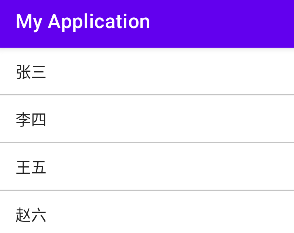

## ListView 和 ListActivity

通过 .xml 和 .kt 结合起来 以组织列表的形式显示所有的列表项



.xml文件代码如下：

```xml
<LinearLayout
    xmlns:android="http://schemas.android.com/apk/res/android"
    android:layout_height="match_parent"
    android:layout_width="match_parent"
    >
    <ListView
        android:id="@+id/listview1"
        android:layout_width="match_parent"
        android:layout_height="wrap_content"
        android:divider="#C4C4C4"
        android:dividerHeight="1dp"
        android:entries="@array/teacher_name"
        android:scrollbars="none">
    </ListView>
</LinearLayout>
```

`android:scrollbars:"none"`不显示滚动条，默认是显示滚动条的

`android:entries="@array/teacher_name"`在res的value文件下创建一个array.xml文件创建数据

```xml
<string-array name="teacher_name">
    <item>张三</item>
    <item>李四</item>
</string-array>
```

`android:divider`设置分割条的样式

`android:dividerHeight`设置分隔条的高度

## Adapter接口

### 实例一：基于 ArrayAdapter 创建 ListView

只能实现单一的列表。

步骤：

1. 先创建一个 ListView 视图，然后在 .kt 文件中获取这个元素，这点和 js 很像，现在 html+css 写好界面，然后 js 获取这个元素
2. 创造数据源 arr
3. 创建适配器，并把布局和数据源传进去。`val adapter = ArrayAdapter(this,android.R.layout.simple_expandable_list_item_1, arr)` 
4. 设置适配器 `listView.setAdapter(adapter)`

`activity_main.xml`代码如下：

```xml
<LinearLayout
    xmlns:android="http://schemas.android.com/apk/res/android"
    android:layout_height="match_parent"
    android:layout_width="match_parent"
    >
    <ListView
        android:id="@+id/listview1"
        android:layout_width="match_parent"
        android:layout_height="wrap_content"
        android:divider="#C4C4C4"
        android:dividerHeight="1dp"
        android:entries="@array/teacher_name"
        android:scrollbars="none">

    </ListView>
</LinearLayout>
```

`MainActivity.xml`代码如下：

```kotlin
class MainActivity : AppCompatActivity() {
        override fun onCreate(savedInstanceState: Bundle?) {
        super.onCreate(savedInstanceState)
        setContentView(R.layout.activity_main)
            val listView: ListView = findViewById(R.id.listview1)
            val arr = arrayOf("章节1", "章节2", "章节3")
            val adapter = ArrayAdapter(this, android.R.layout.simple_expandable_list_item_1, arr)
	        listView.setAdapter(adapter)
        }
```

效果和上面那个ListView组件是一样的。

### 实例二：基于 SimpleAdapter 创建 ListView


可以在每一行放置不同的组件。

步骤：

1. 创建视图
2. 创建数据源
3. 创建适配器
4. 设置适配器

`list_item_layout.xml`代码如下：

```xml
<LinearLayout
    xmlns:android="http://schemas.android.com/apk/res/android"
    android:layout_width="match_parent"
    android:layout_height="match_parent"
    android:orientation="horizontal"
    >
<!--定义一个ImageView组件，用来显示头像-->
    <ImageView
        android:id="@+id/icon"
        android:layout_width="wrap_content"
        android:layout_height="wrap_content">
    </ImageView>
    <LinearLayout
        android:layout_width="match_parent"
        android:layout_height="wrap_content"
        android:orientation="vertical"
        >
        <TextView
            android:id="@+id/name"
            android:layout_height="wrap_content"
            android:layout_width="wrap_content"
            android:textSize="16sp"/>
        <TextView
            android:id="@+id/dexc"
            android:layout_width="wrap_content"
            android:layout_height="wrap_content"
            android:textSize="16sp"
            />
    </LinearLayout>
</LinearLayout>
```

`MainActivity.kt`代码如下：

```kotlin
class MainActivity : AppCompatActivity() {
    //定义名字数组
    private val name = arrayOf("张三", "李四", "王五", "赵六")
    //定义描述任务数组
    private val desc = arrayOf("唱歌","跳舞","打球","跑步")
    //定义头像数组
    private val icon = intArrayOf(R.mipmap.ic_launcher,R.mipmap.ic_launcher,R.mipmap.ic_launcher,R.mipmap.ic_launcher)
    override fun onCreate(savedInstanceState: Bundle?) {
        super.onCreate(savedInstanceState)
        setContentView(R.layout.activity_main)}

      //创建一个 List 集合，List集合的元素是MAP
        val list = mutableListOf<Map<String, Any>>()
        for(i in 0 until name.size){
            val listitem = HashMap<String, Any>()
            listitem["icon"] = icon[i]
            listitem["name"] = name[i]
            listitem["desc"] = desc[i]
            list.add(listitem)
        }
        val adapter = SimpleAdapter(
            this,
            list,
            R.layout.list_item_layout,
            arrayOf("name","icon","desc"),
            intArrayOf(R.id.name,R.id.icon,R.id.dexc)
        )
        listView.setAdapter(adapter)

    }
}
```

### 实例三：基于 BaseAdapter 创建 ListView


可以加按钮。

1. 创建视图
2. 自定义 MyAdapter 类继承自 BaseAdapter，重写方法。
   + getCount() ----- 要绑定的条目的数目，比如格子的数量
   + getItem() ----- 根据一个索引 (位置) 获取该位置的对象
   + getItemId() ----- 获取条目的ID
   + getView() ----- 获取该条目要显示的界面

`MyAdapter.kt`代码如下：

```kotlin
class MyAdapter(
    private var datas: List<Map<String, Any>>,
    private var mContext: Context
) : BaseAdapter() {
//    datas 表示需要绑定到 View 的数据，mContext 表示传入上下文
    init {
        this.datas = datas
        this.mContext = mContext
    }
    override fun getCount(): Int {
//        返回数据的总数
        return datas.size;
    }
    override fun getItem(position: Int): Any {
//        返回在 List 中指定位置的数据的内容
        return datas[position]
    }
    override fun getItemId(position: Int): Long {
//        返回数据在 List 中所在的位置
        return position.toLong()
    }
    // RecyclerView.ViewHolder是抽象类，所以需要自己写一个具体的类
    class MyViewHolder(itemView: View) : RecyclerView.ViewHolder(itemView) {
//        初始化布局中的元素
        var mImageView: ImageView = itemView.findViewById(R.id.imageview)
        var mTextView: TextView = itemView.findViewById(R.id.textview)
        var mButton: Button = itemView.findViewById(R.id.button)

        init {
            mButton.setOnClickListener {
                Toast.makeText(itemView.context, "你点击了我！哈哈", Toast.LENGTH_SHORT).show()
            }
        }
    }
    override fun getView(position: Int, convertView: View?, parent: ViewGroup): View? {
        var itemView = convertView
        val holder: MyViewHolder

        if (itemView == null) {
//            使用自定义的布局文件作为 Layout
            itemView = LayoutInflater.from(mContext).inflate(R.layout.list_item_layout, parent, false)
//            减少 findView 的次数
            holder = MyViewHolder(itemView)
            itemView.tag = holder
        } else {
            holder = itemView.tag as MyViewHolder
        }
//        从传入的数据中提取数据并绑定到 View 中
        holder.mImageView.setImageResource(datas[position]["img"] as Int)
        holder.mTextView.setText(datas[position]["title"].toString())
        holder.mButton.setText(datas[position]["button"].toString())
        return itemView
    }
    class ViewHolder {
        lateinit var mImageView: ImageView
        lateinit var mTextView: TextView
        lateinit var mButton: Button
    }
}
```

3. 在 MainActivity 中添加数据以及为 ListView 添加上文自定义的Adapter，具体代码如下所示：

```kotlin
class MainActivity : AppCompatActivity() {
    private lateinit var mListView: ListView
    private lateinit var myAdapter: MyAdapter
    private val list: MutableList<Map<String, Any>> = mutableListOf()

    override fun onCreate(savedInstanceState: Bundle?) {
        super.onCreate(savedInstanceState)
        setContentView(R.layout.activity_main)
        initData()
        mListView = findViewById(R.id.listview)
        myAdapter = MyAdapter(list,this)
        mListView.setAdapter(myAdapter)
    }
    
    private fun initData(){
        var map = hashMapOf<String,Any>()
        map["img"] = R.drawable.android
        map["title"] = "Android"
        map["button"] = "学习"
        list.add(map)
    }
}
```

