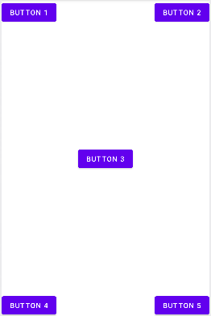

## 常用控件的使用方法

### TextView

Android 中所有的控件都具有`android:layout_width`和`android:layout_height`这两个属性，可选值有3种：`match_parent`、`wrap_content`和固定值。

`match_parent`：让当前控件的大小和父布局的大小一样。

`wrap_content`：让当前控件的大小能够刚好包含住里面的内容。

固定值：给控件一个指定的固定的尺寸，单位一般用dp，这是一种屏幕密度无关的尺寸单位，可以保证在不同分辨率的手机上显示效果尽量一致。

```xml
<LinearLayout xmlns:android="http://schemas.android.com/apk/res/android"
 android:orientation="vertical"
 android:layout_width="match_parent"
 android:layout_height="match_parent">
 <TextView
 android:id="@+id/textView"
 android:layout_width="match_parent"
 android:layout_height="wrap_content"
 android:gravity="center"
 android:text="This is TextView"/>
</LinearLayout> 
```

`android:gravity`：指定文字的对齐方式，可选值有`top`、`buttom`、`start`、`end`、`center`，可以用'|'来同时指定多个值

```xml
<TextView 
 android:id="@+id/textView"
 android:layout_width="match_parent"
 android:layout_height="wrap_content"
 android:gravity="center"
 android:textColor="#00ff00"
 android:textSize="24sp"
 android:text="This is TextView"/>
```

`android:textColor`：指定文字的颜色

`android:textSize`：指定文字的大小

### Button

Andr oid 系统默认会将按钮上的英文字母全部转换成大写，如果这不是想要的效果，可以在xml添加`android:textAllCaps="false"`这个属性

### EditText

EditText 是程序用于和用户进行交互的另一个重要控件，它允许用户在控件里输入和编辑内容，并可以在程序中对这些内容进行处理。

```xml
<EditText
    android:id="@+id/editText"
    android:layout_width="match_parent"
    android:layout_height="wrap_content"
    android:hint="Type something here"
    android:maxLines="2" 
    />
```

`android:hint`：提示性文本。

`android:maxLines`：指定最大行数

### ImageView

ImageView 是用于在界面上展示图片的一个控件，它可以让我们的程序界面变得更加丰富多彩。

```xml
<ImageView
 android:id="@+id/imageView"
 android:layout_width="wrap_content"
 android:layout_height="wrap_content"
 android:src="@drawable/img_1"
 /> 
```

### ProgressBar

ProgressBar 用于在界面上显示一个进度条，表示我们的程序正在加载一些数据。

```xml
<ProgressBar
 android:id="@+id/progressBar"
 android:layout_width="match_parent"
 android:layout_height="wrap_content"
 /> 
```

所有的 Android 控件都具有这个属性，可以通过 `android:visibility` 进行指定，可选值有3种：visible、invisible 和 gone。

visible 表示控件是可见的，这个值是默认值，不指定 android:visibility 时，控件都是可见的。

invisible 表示控件不可见，但是它仍然占据着原来的位置和大小，可以理解成控件变成透明状态了。

gone则表示控件不仅不可见，而且不再占用任何屏幕空间。

我们可以通过代码来设置控件的可见性，使用的是 setVisibility() 方法，允许传入View.VISIBLE、 View.INVISIBLE和 View.GONE 这3种值。

```kotlin
override fun onClick(v: View?) {
    when (v?.id) {
        R.id.button -> {
            if (progressBar.visibility == View.VISIBLE) {
                progressBar.visibility = View.GONE
            } else {
                progressBar.visibility = View.VISIBLE
            }
        }
    } 
```

```xml
<ProgressBar
 android:id="@+id/progressBar"
 android:layout_width="match_parent"
 android:layout_height="wrap_content"
 style="?android:attr/progressBarStyleHorizontal"
 android:max="100"
 />
```

水平进度条

### AlertDialog

AlertDialog 可以在当前界面弹出一个对话框，这个对话框是置顶于所有界面元素之上的，能够屏蔽其他控件的交互能力，因此 AlertDialog 一般用于提示一些非常重要的内容或者警告信息。

```kotlin
AlertDialog.Builder(this).apply {
    setTitle("This is Dialog")
    setMessage("Something important.")
    setCancelable(false)
    setPositiveButton("OK") { dialog, which ->
                         }
    setNegativeButton("Cancel") { dialog, which ->
                             }
    show()
} 

```

`setPositiveButton()`方法为对话框设置确定按钮的点击事件

`setNegativeButton()`方法设置取消按钮的点击事件


## 三种基本布局

布局是一种可用于放置很多控件的容器，它可以按照一定的规律调整内部控件的位置，从而编写出精美的界面。


### LinearLayout

LinearLayout 又称作线性布局，是一种非常常用的布局。

```xml
<LinearLayout xmlns:android="http://schemas.android.com/apk/res/android"
    android:orientation="horizontal"
    android:layout_width="match_parent"
    android:layout_height="match_parent">
</LinearLayout>
```

`  android:orientation="horizontal"`：水平排列（默认）

`android:orientation="vertical"`：垂直排列

`android:gravity` ：用于指定文字在控件中的对齐方式

`android:layout_gravity`：用于指定控件在布局中的对齐方式。

`android:layout_weight`：这个属性允许我们使用比例的方式来指定控件的大小，它在手机屏幕的适配性方面可以起到非常重要的作用。

```xml
<LinearLayout xmlns:android="http://schemas.android.com/apk/res/android"
    android:orientation="horizontal"
    android:layout_width="match_parent"
    android:layout_height="match_parent">
    <EditText
        android:id="@+id/input_message"
        android:layout_width="0dp"
        android:layout_height="wrap_content"
        android:layout_weight="1"
        android:hint="Type something"
        />
    <Button
        android:id="@+id/send"
        android:layout_width="0dp"
        android:layout_height="wrap_content"
        android:layout_weight="1"
        android:text="Send"
        />
</LinearLayout>
```

EditText 和 Button 里将`android:layout_weight`属性的值指定为1，这表示 EditText 和 Button 将在水平方向上平分宽度。

### RelativeLayout

RelativeLayout 又称作相对布局，也是一种非常常用的布局。RelativeLayout 显得更加随意，它可以通过相对定位的方式让控件出现在布局的任何位置。

```xml
<RelativeLayout xmlns:android="http://schemas.android.com/apk/res/android"
    android:layout_width="match_parent"
    android:layout_height="match_parent">
    <Button
        android:id="@+id/button1"
        android:layout_width="wrap_content"
        android:layout_height="wrap_content"
        android:layout_alignParentLeft="true"
        android:layout_alignParentTop="true"
        android:text="Button 1" />
    <Button
        android:id="@+id/button2"
        android:layout_width="wrap_content"
        android:layout_height="wrap_content"
        android:layout_alignParentRight="true"
        android:layout_alignParentTop="true"
        android:text="Button 2" />
    <Button
        android:id="@+id/button3"
        android:layout_width="wrap_content"
        android:layout_height="wrap_content"
        android:layout_centerInParent="true"
        android:text="Button 3" />
    <Button
        android:id="@+id/button4"
        android:layout_width="wrap_content"
        android:layout_height="wrap_content"
        android:layout_alignParentBottom="true"
        android:layout_alignParentLeft="true"
        android:text="Button 4" />
    <Button
        android:id="@+id/button5"
        android:layout_width="wrap_content"
        android:layout_height="wrap_content"
        android:layout_alignParentBottom="true"
        android:layout_alignParentRight="true"
        android:text="Button 5" />
</RelativeLayout>
```

效果如下图所示：



```xml
<RelativeLayout xmlns:android="http://schemas.android.com/apk/res/android"
 android:layout_width="match_parent"
 android:layout_height="match_parent">
 <Button
 android:id="@+id/button3"
 android:layout_width="wrap_content"
 android:layout_height="wrap_content"
 android:layout_centerInParent="true"
 android:text="Button 3" />
 <Button
 android:id="@+id/button1"
 android:layout_width="wrap_content" 
 android:layout_height="wrap_content"
 android:layout_above="@id/button3"
 android:layout_toLeftOf="@id/button3"
 android:text="Button 1" />
 <Button
 android:id="@+id/button2"
 android:layout_width="wrap_content"
 android:layout_height="wrap_content"
 android:layout_above="@id/button3"
 android:layout_toRightOf="@id/button3"
 android:text="Button 2" />
 <Button
 android:id="@+id/button4"
 android:layout_width="wrap_content"
 android:layout_height="wrap_content"
 android:layout_below="@id/button3"
 android:layout_toLeftOf="@id/button3"
 android:text="Button 4" />
 <Button
 android:id="@+id/button5"
 android:layout_width="wrap_content"
 android:layout_height="wrap_content"
 android:layout_below="@id/button3"
 android:layout_toRightOf="@id/button3"
 android:text="Button 5" />
</RelativeLayout> 
```

效果如下图所示：


### FrameLayout

FrameLayout 又称作帧布局。这种布局没有丰富的定位方式，所有的控件都会默认摆放在布局的左上角。

## 自定义布局

```xml
<LinearLayout xmlns:android="http://schemas.android.com/apk/res/android"
 android:layout_width="match_parent"
 android:layout_height="match_parent" >
 <include layout="@layout/title" />
</LinearLayout>
```

通过一行 include 语句引入标题栏布局。

```kotlin
class TitleLayout(context: Context, attrs: AttributeSet) : LinearLayout(context, attrs) {
 init {
 LayoutInflater.from(context).inflate(R.layout.title, this)
 }
} 
```

`inflate()`方法可以动态加载一个布局文件。inflate()方法接收两个参数：第一个参数是要加载的布局文件的id，这里我们传入 R.layout.title；第二个参数是给加载好的布局再添加一个父布局。

### 最常用和最难用的控件：ListView

```xml
<ListView
    android:id="@+id/listView"
    android:layout_width="match_parent"
    android:layout_height="match_parent" />
```

```kotlin
class ActivityLifeCycleTest : BaseActivity() {
    private val data = listOf("Apple", "Banana", "Orange", "Watermelon",
        "Pear", "Grape", "Pineapple", "Strawberry", "Cherry", "Mango",
        "Apple", "Banana", "Orange", "Watermelon", "Pear", "Grape",
        "Pineapple", "Strawberry", "Cherry", "Mango")
    override fun onCreate(savedInstanceState: Bundle?) {
        super.onCreate(savedInstanceState)
        setContentView(R.layout.activity_life_cycle_test)
        val adapter = ArrayAdapter<String>(this,android.R.layout.simple_list_item_1,data)
        listView.adapter = adapter
    }
}
```

效果图如下：


## 更强大的滚动控件：RecyclerView

首先导入包

```kotlin
implementation 'androidx.recyclerview:recyclerview:1.0.0'
```

activity_main.xml文件

```xml
<LinearLayout xmlns:android="http://schemas.android.com/apk/res/android"
 android:layout_width="match_parent"
 android:layout_height="match_parent">
 <androidx.recyclerview.widget.RecyclerView
 android:id="@+id/recyclerView"
 android:layout_width="match_parent"
 android:layout_height="match_parent" />
</LinearLayout>
```

FruitAdapter文件

```kotlin
class FruitAdapter(val fruitList: List<Fruit>) :
 RecyclerView.Adapter<FruitAdapter.ViewHolder>() {
 inner class ViewHolder(view: View) : RecyclerView.ViewHolder(view) {
 val fruitImage: ImageView = view.findViewById(R.id.fruitImage)
 val fruitName: TextView = view.findViewById(R.id.fruitName)
 }
 override fun onCreateViewHolder(parent: ViewGroup, viewType: Int): ViewHolder {
 val view = LayoutInflater.from(parent.context)
 .inflate(R.layout.fruit_item, parent, false)
 return ViewHolder(view)
 }
 override fun onBindViewHolder(holder: ViewHolder, position: Int) {
 val fruit = fruitList[position]
 holder.fruitImage.setImageResource(fruit.imageId)
 holder.fruitName.text = fruit.name
 }
 override fun getItemCount() = fruitList.size
} 
```

MainActivity文件

```kotlin
class MainActivity : AppCompatActivity() {
    private val fruitList = ArrayList<Fruit>()
    override fun onCreate(savedInstanceState: Bundle?) {
     super.onCreate(savedInstanceState)
     setContentView(R.layout.activity_main)
     initFruits() // 初始化水果数据
     val layoutManager = LinearLayoutManager(this)
     recyclerView.layoutManager = layoutManager
     val adapter = FruitAdapter(fruitList)
     recyclerView.adapter = adapter
 }
 private fun initFruits() {
     repeat(2) {
     fruitList.add(Fruit("Apple", R.drawable.apple_pic))
     fruitList.add(Fruit("Banana", R.drawable.banana_pic))
     fruitList.add(Fruit("Orange", R.drawable.orange_pic))
     fruitList.add(Fruit("Watermelon", R.drawable.watermelon_pic))
     fruitList.add(Fruit("Pear", R.drawable.pear_pic))
     fruitList.add(Fruit("Grape", R.drawable.grape_pic))
     fruitList.add(Fruit("Pineapple", R.drawable.pineapple_pic))
     fruitList.add(Fruit("Strawberry", R.drawable.strawberry_pic))
     fruitList.add(Fruit("Cherry", R.drawable.cherry_pic))
     fruitList.add(Fruit("Mango", R.drawable.mango_pic))
     }
 }
}
```

## 聊天界面


首先在`app/build.gradle`导入`RecyclerView`包

接下来开始编写主界面，修改`activity_main.xml`里的代码，代码如下：

```xml
<LinearLayout xmlns:android="http://schemas.android.com/apk/res/android"
    android:orientation="vertical"
    android:layout_width="match_parent"
    android:layout_height="match_parent"
    android:background="#d8e0e8" >
    <androidx.recyclerview.widget.RecyclerView
        android:id="@+id/recyclerView"
        android:layout_width="match_parent"
        android:layout_height="0dp"
        android:layout_weight="1" />
    <LinearLayout
        android:layout_width="match_parent"
        android:layout_height="wrap_content" >
        <EditText
            android:id="@+id/inputText"
            android:layout_width="0dp"
            android:layout_height="wrap_content"
            android:layout_weight="1"
            android:hint="Type something here"
            android:maxLines="2" />
        <Button
            android:id="@+id/send"
            android:layout_width="wrap_content"
            android:layout_height="wrap_content"
            android:text="Send" />
    </LinearLayout>
</LinearLayout>
```

定义消息实体类，新建Msg，代码如下：

```kotlin
class Msg(val content: String, val type: Int) {
    companion object {
        const val TYPE_RECEIVED = 0
        const val TYPE_SENT = 1
    }
}
```

> content表示的是消息的内容，type表示的是消息的类型，TYPE_RECEIVED表示是收到的消息，TYPE_SENT表示的是发送的消息。

接下来编写写RecyclerView的子项布局，新建`msg_left_item.xml`，代码如下：

```xml
<FrameLayout xmlns:android="http://schemas.android.com/apk/res/android"
    android:layout_width="match_parent"
    android:layout_height="wrap_content"
    android:padding="10dp">
    <LinearLayout
        android:layout_width="wrap_content"
        android:layout_height="wrap_content"
        android:layout_gravity="left"
        android:background="@drawable/message_left_original">
        <TextView
            android:id="@+id/leftMsg"
            android:layout_width="wrap_content"
            android:layout_height="wrap_content"
            android:layout_gravity="center"
            android:layout_margin="10dp"
            android:textColor="#fff"/>
    </LinearLayout>
</FrameLayout>
```

这是接收消息的子布局。我们让收到的消息左对齐。

我们还需要编写一个发送消息的子项布局，代码如下：

```xml
<FrameLayout xmlns:android="http://schemas.android.com/apk/res/android"
    android:layout_width="match_parent"
    android:layout_height="wrap_content"
    android:padding="10dp">
    <LinearLayout
        android:layout_width="wrap_content"
        android:layout_height="wrap_content"
        android:layout_gravity="right"
        android:background="@drawable/message_right_original1">
        <TextView
            android:id="@+id/rightMsg"
            android:layout_width="wrap_content"
            android:layout_height="wrap_content"
            android:layout_gravity="center"
            android:layout_margin="10dp"
            android:textColor="#000"/>
    </LinearLayout>
</FrameLayout>
```

接下来需要创建`RecyclerView`的适配器类，新建类`MsgAdapter`，代码如下所示

```kotlin
class MsgAdapter(val msgList:List<Msg>) : RecyclerView.Adapter<RecyclerView.ViewHolder>() {
    inner class LeftViewHolder(view:View) : RecyclerView.ViewHolder(view){
        val leftMsg:TextView = view.findViewById(R.id.leftMsg)
    }
    inner class RightViewHolder(view: View):RecyclerView.ViewHolder(view){
        val rightMsg: TextView = view.findViewById(R.id.rightMsg)
    }
    override fun getItemViewType(position:Int):Int{
        val msg = msgList[position]
        return msg.type
    }
    override fun onCreateViewHolder(parent: ViewGroup, viewType:Int) = if(viewType == Msg.TYPE_RECEIVED){
        val view = LayoutInflater.from(parent.context).inflate(R.layout.msg_left_item,parent,false)
        LeftViewHolder(view)
    }else{
        val view = LayoutInflater.from(parent.context).inflate(R.layout.msg_right_item,parent,false)
        RightViewHolder(view)
    }
    override fun onBindViewHolder(holder:RecyclerView.ViewHolder,position:Int){
        val msg = msgList[position]
        when(holder){
            is LeftViewHolder -> holder.leftMsg.text = msg.content
            is RightViewHolder -> holder.rightMsg.text = msg.content
            else -> throw IllegalArgumentException()
        }
    }
    override fun getItemCount() = msgList.size
}
```

最后修改`MainActivity`中的代码，为`RecyclerView`初始化一些数据，并给发送按钮加入事件响应，代码如下所示：

```kotlin
class ActivityLifeCycleTest : AppCompatActivity(), View.OnClickListener {
    private val msgList = ArrayList<Msg>()
    private var adapter: MsgAdapter? = null
    override fun onCreate(savedInstanceState: Bundle?) {
        super.onCreate(savedInstanceState)
        setContentView(R.layout.activity_life_cycle_test)
        initMsg() // 初始化消息
        val layoutManager = LinearLayoutManager(this)
        recyclerView.layoutManager = layoutManager
        adapter = MsgAdapter(msgList)
        recyclerView.adapter = adapter
        send.setOnClickListener(this)
    }
    override fun onClick(v: View?) {
        when (v) {
            send -> {
                val content = inputText.text.toString()
                if (content.isNotEmpty()) {
                    val msg = Msg(content, Msg.TYPE_SENT)
                    msgList.add(msg)
                    adapter?.notifyItemInserted(msgList.size - 1) // 当有新消息时，
					//  刷新RecyclerView中的显示
                    recyclerView.scrollToPosition(msgList.size - 1) // 将RecyclerView
					//  定位到最后一行
                    inputText.setText("") // 清空输入框中的内容
                }
            }
        }
    }
    private fun initMsg() {
        val msg1 = Msg("Hello guy.", Msg.TYPE_RECEIVED)
        msgList.add(msg1)
        val msg2 = Msg("Hello. Who is that?", Msg.TYPE_SENT)
        msgList.add(msg2)
        val msg3 = Msg("This is Tom. Nice talking to you. ", Msg.TYPE_RECEIVED)
        msgList.add(msg3)
    }
}
```

## 延迟初始化和密封类

### 对变量延迟初始化

延迟初始化使用的是`lateinit`关键字，它可以告诉`Kotlin`编译器，我会在晚些时候对这个变量 进行初始化，这样就不用在一开始的时候将它赋值为null了。

```kotlin
private lateinit var adapter: MsgAdapter 
```

另外，我们还可以通过代码来判断一个全局变量是否已经完成了初始化，这样在某些时候能够 有效地避免重复对某一个变量进行初始化操作，示例代码如下：

```kotlin
if (!::adapter.isInitialized) {
 adapter = MsgAdapter(msgList)
 } 
```

具体语法就是这样，`::adapter.isInitialized`可用于判断adapter变量是否已经初始化。虽然语法看上去有点奇怪，但这是固定的写法。然后我们再对结果进行取反，如果还没有初始化，那么就立即对adapter变量进行初始化，否则什么都不用做。

### 密封类

密封类的关键字是`sealed class`，它的用法同样非常简单，我们可以轻松地将`Result`接口改 造成密封类的写法：

```kotlin
sealed class Result
class Success(val msg: String) : Result()
class Failure(val error: Exception) : Result()
```

当在when语句中传入一个密封类变量作为条件时，Kotlin 编译器会自动检查该密封类有哪些子类，并强制要求你将每一个子类所对应 的条件全部处理。

这样就可以保证，即使没有编写else条件，也不可能会出现漏写条件分支的情况。