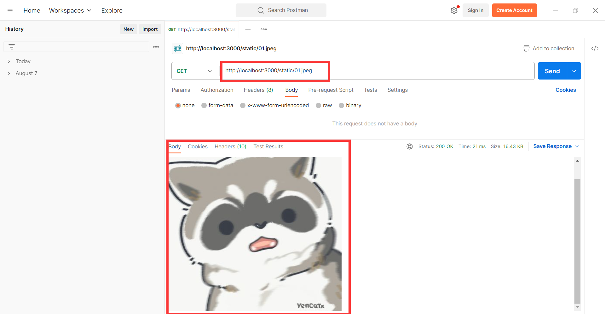

[express官方文档](https://www.expressjs.com.cn/)

**什么是api**

前后端分离，前端通过ajax请求数据，通过api接口实现数据的请求：

一般api接口实现逻辑

1. 接收用户传递的数据
2. 处理数据
3. 返回数据

## 1. express基本使用

**安装express：**

`npm install express --save`

### 1.1 get接口测试

接口get方式请求通过request.query接收参数

```js
// 1. 引入模块
const express = require('express')
// 2. 实例化服务器
const app = express()
// 3. 监听端口，开启服务器
app.listen(3000, () => {
  console.log('服务器启动~~~')
})
// 4. 编写api接口
app.get('/user/login', function (request, response) {
  console.log('客户端请求')
  response.send({ err: 0, data: '登录成功' })
})
```

`访问：http://localhost:3000/user/login`

`返回数据：{"err":0,"data":"登录成功"}`

### 1.2 post接口

这里post接口的测试可以通过postman的工具来发起请求

[postman下载](https://www.postman.com/downloads/)

接口通过 request.body 获取用户数据

**注意：express不能解析消息体！！！需要通过第三方插件`body-parser`实现解析!!!**

安装：`npm install body-parser --save`

**app.use()** 表示使用一个中间件(插件)

服务器端：

```js
// 1. 引入模块
const express = require('express')
const bodyparser = require('body-parser')
// 2. 实例化服务器
const app = express()
// 使用中间件：解析json数据
app.use(bodyparser.json())

// 3. 监听端口，开启服务器
app.listen(3000, () => {
  console.log('服务器启动')
})

// 4. 编写post接口
app.post('/user/reg', function (request, response) {
  console.log('post获取数据:')
  console.log(request.body)
  const { name, password } = request.body
  if (name == 'nzs' && password == '123') {
    response.send({ err: 0, data: '注册成功' })
  } else {
    response.send({ err: -1, data: '注册失败' })
  }
})

```

**postman测试**


## 2. express路由

**目录结构:**


**userRouter.js**

```js
// 1. 引入模块
var express = require("express")
var router = express.Router()
// 2. 接口
router.get("/add",function (request,response) {    
    response.send({err:0,data:"添加用户接口"})
});

router.get("/del",function (request,response) {    
    response.send({err:0,data:"删除用户接口"})
});
// 3. 导出
module.exports = router
```

**foodRouter.js**

```js
// 1. 引入模块var 
express = require("express")
var router = express.Router()
// 2. 接口
router.get("/add",function (request,response) {    
    response.send({err:0,data:"添加食物接口"})
});

router.get("/del",function (request,response) {    
    response.send({err:0,data:"删除食物接口"})
});
// 3. 导出
module.exports = router
```

**server.js**

```js
// 1. 导入模块
var express = require("express")
const app = express()

// 2. 监听端口
app.listen(3000,function () {    
    console.log("服务器启动~~~")
});

// 3. 路由接口
let userRouter = require("./router/userRouter")
let foodRouter = require("./router/foodRouter")
app.use("/user",userRouter)
app.use("/food",foodRouter)
```


## 3. 中间件 middlewear

在调用api时，有些数据只有用户登录以后才能获取，所以需要token来判断用户是否已经登录，由于这个判断的代码在很多地方都需要使用，所以直接使用中间件，在用户刚开始访问时就进行判断，正确以后再调用`next()`，允许用户获取数据！

### 3.1 全局中间件

```js
const express = require('express')
const app = express()
app.listen(3000, function () {
  console.log('服务器启动~')
})
// 通过全局中间件 拦截
app.use('/', function (request, response, next) {
  const { token } = request.query
  if (token) {
    response.send('有token，已登录！')
    next() // 通过验证往下执行api函数
  } else {
    response.send('无token')
  }
})

app.get('/test1', function (request, response) {
  response.send('test1')
})
```

### 3.2 局部中间件

```js
const express = require('express')
const app = express()
app.listen(3000, function () {
  console.log('服务器启动')
})
app.get(
  '/test',
  function (request, response, next) {
    console.log('验证中')
    next()
  },
  function (request, response) {
    response.send('test验证成功！')
    console.log('验证成功！')
  }
)
```

### 3.3 静态资源目录static使用

```js
const express = require('express')
const path = require('path')
const app = express()

console.log(__dirname)  // 当前文件目录
const static_path = path.join(__dirname, './static/') // 实现路径拼接
console.log(static_path)

app.use('/static', express.static(static_path))
app.listen(3000, () => {
  console.log('服务器启动')
})
```

`访问：http://localhost:3000/static/01.jpeg`

